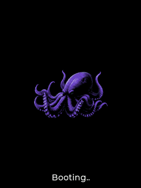

<p align="center">
  
</p>


# High Boy Firmware (Beta)

[](LICENSE)
[](https://github.com/HighCodeh/TentacleOS/stargazers)
[](https://github.com/HighCodeh/TentacleOS/network/members)
[](https://github.com/HighCodeh/TentacleOS/pulls)

> **Languages**:  [🇺🇸 English](README.md) | [🇧🇷 Português](README.pt.md) 

This repository contains a **firmware in development** for the **High Boy** platform.
**Warning:** this firmware is in its **beta phase** and is **still incomplete**.


## Officially Supported Targets

We are expanding support for the latest Espressif chips:

| Target | Status |
| :--- | :--- |
| **ESP32-S3** | Main Development |
| **ESP32-P4** | Experimental (firmware_p4) |
| **ESP32-C5** | Experimental (firmware_c5) |


## Firmware Structure

Unlike basic examples with a single `main.c`, this project uses a modular structure organized into **components**, which are divided as follows:

- **Drivers** – Handles hardware drivers and interfaces.
- **Services** – Implements support functionalities and auxiliary logic.
- **Core** – Contains the system's central logic and main managers.
- **Applications** – Specific applications that use the previous modules.

This division facilitates scalability, code reuse, and firmware organization.

See the general project architecture:
<p align="center">
  
</p>


## How to use this project

We recommend that this project serves as a basis for custom projects with ESP32-S3.
To start a new project with ESP-IDF, follow the official guide:
[ESP-IDF Documentation - Create a new project](https://docs.espressif.com/projects/esp-idf/en/latest/api-guides/build-system.html#start-a-new-project)

### Initial project structure

Despite the modular structure, the project still maintains an organization compatible with the ESP-IDF build system (CMake).

Example layout:

```bash
├── CMakeLists.txt
├── components
│   ├── Drivers
│   ├── Services
│   ├── Core
│   └── Applications
├── main
│   ├── CMakeLists.txt
│   └── main.c
└── README.md
```


## Native HLE simulator

The host-level emulation (HLE) target runs the P4 UI, LVGL, host-backed storage,
and a simulated C5 SPI bridge on Linux. It is intended for UI and firmware-flow
development without a connected High Boy.

<p align="center">
  
  <br/>
  <em>Boot screen rendered by the native SDL simulator.</em>
</p>

### Requirements

- Linux
- CMake 3.16 or newer
- A C11/C++17 toolchain
- Git and the SDL2 development headers
- Internet access during the first configure, which downloads LVGL, cJSON, and
  GoogleTest

On Ubuntu or Debian:

```bash
sudo apt update
sudo apt install build-essential cmake git libsdl2-dev
```

ESP-IDF, an ESP32 toolchain, and connected High Boy hardware are not required
for the native simulator.

### Build and run

Run these commands from the repository root:

```bash
cmake -S tools/hle -B build
cmake --build build --target hle_interactive -j
./build/hle_interactive
```

The first build also converts the assets under `firmware_p4/assets`. After UI
or firmware changes, rerun the `cmake --build` command and restart the
simulator; reconfiguration is only needed after CMake or source-layout changes.

### Controls

| High Boy input | Keyboard |
| :--- | :--- |
| Directional buttons | Arrow keys or W/A/S/D |
| OK | Enter, keypad Enter, or Space |
| Back | Backspace or Escape |
| Exit simulator | Ctrl+Q or close the window |

### Storage

The simulator stores `/sdcard` data under `/tmp/hle_storage` by default.
Override the location with `HLE_STORAGE_PATH`:

```bash
HLE_STORAGE_PATH="$HOME/.local/state/tentacleos-hle" ./build/hle_interactive
```

Point `HLE_STORAGE_PATH` at a new empty directory to exercise the firmware's
first-boot flow again.

### Headless snapshots

For deterministic, headless UI snapshots:

```bash
SDL_VIDEODRIVER=dummy \
HLE_SNAPSHOT_PATH=/tmp/high-boy.ppm \
HLE_SNAPSHOT_MS=6500 \
./build/hle_interactive
```

The snapshot example renders for 6500 ms, writes a PPM image, and exits. It is
also suitable for CI or SSH sessions without a display server.

### Tests

Run the native regression suite with:

```bash
cmake --build build --target hle_tests -j
ctest --test-dir build --output-on-failure
```

#### Example: testing display output

Every `*.cpp` file under `tools/hle/tests` is compiled into `hle_tests` and
automatically registered with GoogleTest. For example, create
`tools/hle/tests/test_my_ui.cpp`:

```cpp
#include <array>
#include <cstdint>

#include <gtest/gtest.h>

#include "hle/hle_display.h"

TEST(MyUIScreen, DrawsExpectedPixel) {
    auto &display = hle::Display::instance();
    display.fill_screen(0);

    constexpr uint16_t expected_color = 0xF81F;
    display.draw_bitmap(12, 20, 13, 21, &expected_color);

    std::array<uint16_t, hle::LCD_H_RES * hle::LCD_V_RES> framebuffer{};
    ASSERT_TRUE(display.copy_pixels_if_dirty(
        framebuffer.data(), hle::LCD_H_RES * sizeof(uint16_t)));
    EXPECT_EQ(framebuffer[(20 * hle::LCD_H_RES) + 12], expected_color);
}
```

Build and run only that test:

```bash
cmake --build build --target hle_tests -j
./build/hle_tests --gtest_filter=MyUIScreen.DrawsExpectedPixel
```

Use the same pattern for NVS, SPI bridge, input, and other host-emulated
contracts. Tests that include C firmware headers should place those includes
inside an `extern "C"` block.

### Scope and limitations

The HLE covers UI and host-emulated firmware flows. Wi-Fi, Bluetooth, radio,
and other physical-hardware behavior still require target testing.


## How to Contribute

Contributions are what make the open-source community such an amazing place to learn, inspire, and create. Any contributions you make are **greatly appreciated**.

1. Fork the Project
2. Create your Feature Branch (`git checkout -b feat/AmazingFeature`)
3. Commit your Changes using **Conventional Commits** (`git commit -m 'feat(scope): add some AmazingFeature'`)
4. Push to the Branch (`git push origin feat/AmazingFeature`)
5. Open a Pull Request

Please read our [**CONTRIBUTING.md**](CONTRIBUTING.md) for more details on the coding style and build process.


## Code of Conduct

We are committed to providing a friendly, safe, and welcoming environment for all. Please read our [**Code of Conduct**](CODE_OF_CONDUCT.md) to understand the expectations for participating in this project.


## Our Supporters

Special thanks to the partners supporting this project:

[](https://www.pcbway.com)


## License
This project is licensed under the **GNU General Public License v3.0**. See the [LICENSE](LICENSE) file for details.
